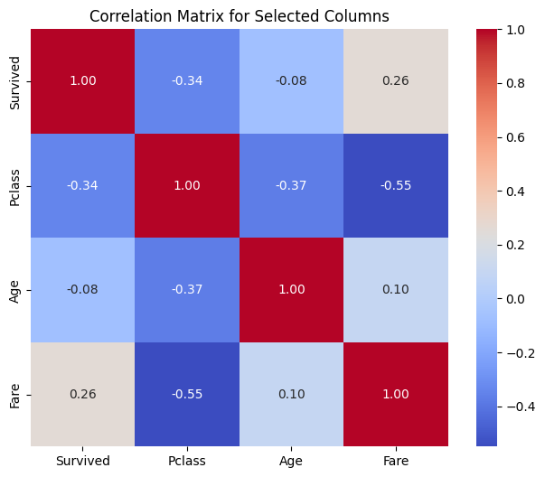
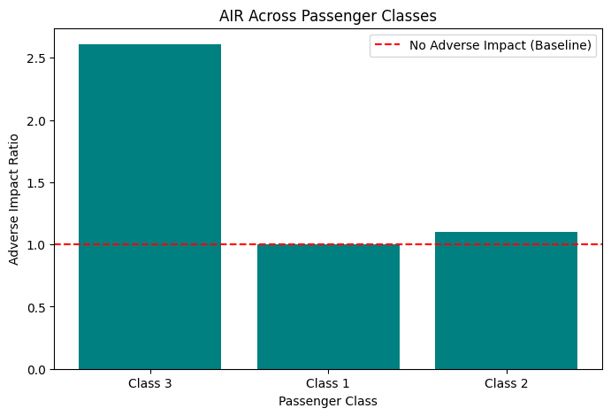
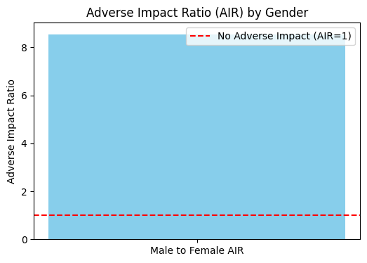

# Titanic Survival Prediction Model Card

### Basic Information

* **Person or organization developing model**: My Tran, mtran127@gwu.edu
* **Model date**: December, 2024
* **Model version**: 1.0
* **License**: MIT
* **Model implementation code**: [Titanic_Survival_Prediction.ipynb] (https://github.com/mytran127/DNSC3288_Project/blob/main/Titanic_Survival_Prediction.ipynb)
  
### Intended Use
* **Primary intended uses**: This dataset serves as a foundational training and testing resource for building machine learning models. An example model use case is to predict the likelihood of an event based on historical data.
* **Primary intended users**: Students enrolled in GW DNSC courses.
* **Out-of-scope use cases**: Applying the model predictions directly to make decisions that affect individuals.

### Training Data

* Data Dictionary:

| Name         | Modeling Role | Measurement Level | Description                                                        |
|--------------|---------------|-------------------|--------------------------------------------------------------------|
| `PassengerId` | ID            | Nominal           | Unique identifier for each passenger.                              |
| `Survived`    | Target        | Binary            | Indicates if a passenger survived the Titanic disaster (0 = No, 1 = Yes). |
| `Pclass`      | Feature       | Ordinal           | Ticket class (1 = 1st, 2 = 2nd, 3 = 3rd). |
| `Name`        | None          | Nominal           | Full name of the passenger.                                        |
| `Sex`         | Feature       | Nominal           | Gender of the passenger (Male, Female).                            |
| `Age`         | Feature       | Ratio             | Age of the passenger in years.                                     |
| `SibSp`       | Feature       | Ratio             | Number of siblings or spouses aboard the Titanic.                  |
| `Parch`       | Feature       | Ratio             | Number of parents or children aboard the Titanic.                  |
| `Ticket`      | None          | Nominal           | Ticket number.                                                     |
| `Fare`        | Feature       | Continuous        | Price paid for the ticket.                                         |
| `Cabin`       | Feature       | Nominal           | Cabin number where the passenger stayed.                           |
| `Embarked`    | Feature       | Nominal           | Port of embarkation (C = Cherbourg, Q = Queenstown, S = Southampton). |

* **Source of training data**: Kaggle
* **How training data was divided into training and validation data**: 80% training, 20% validation
* **Number of rows in training and validation data**:
  * Training rows: 891
  * Validation rows: 418

### Test Data
* **Source of test data**: Kaggle
* **Number of rows in test data**: 418
* **State any differences in columns between training and test data**:
  * Missing Columns: Unlike the training data, the test data does not include the `Survived` column, as this is the target variable that the model is expected to predict.

### Model details
* **Columns used as inputs in the final model**: 'Pclass',
       'Sex', 'Age', 'SibSp', 'Parch', 'Fare'
* **Column(s) used as target(s) in the final model**: 'Survived'
* **Type of model**: Random Forest Classifier
* **Software used to implement the model**: Python, scikit-learn
* **Version of the modeling software**: 0.24.1
* **Hyperparameters or other settings of your model**:
  Configuration of the Random Forest model included:
  - `n_estimators`: 100
  - `max_depth`: None
  - `min_samples_split`: 2
  - `min_samples_leaf`: 1
  - `bootstrap`: True

### Quantitative Analysis

* Models were assessed primarily with AUC and AIR. See details below:

| Train AUC | Validation AUC | Test AUC |
| ------ | ------- | -------- |
| 0.9977 | 0.8833  | 0.744* |

| Group | Validation AIR |
|-------|-----|
| Passenger Class 1 | 1.000 |
| Passeneger Class 2 | 1.101 |
| Passenger Class 3 | 2.609 |

(*Test AUC taken from Kaggle submission )

#### Correlation Heatmap

#### AIR By Passenger Class

#### AIR By Gender

## Ethical Considerations

### Potential Negative Impacts of Using the Model

#### Math or Software Problems
* **Overfitting**: Despite the robustness against overfitting, Random Forest might fail to generalize to unseen data if the training set is not representative.
* **Bias in Data**: The training data may contain inherent biases, which the model could amplify, leading to unfair predictions.

#### Real-world Risks
* **Misuse of Predictions**: Improper interpretation or use of model predictions could lead to sensitive or unethical decisions.
* **Impact on Descendants**: Use of such data might be viewed as insensitive or offensive by relatives of those onboard the Titanic.
* **Privacy Concerns**: Using detailed passenger data could violate privacy if not properly anonymized.

### Potential Uncertainties Relating to the Impacts of Using the Model

#### Math or Software Problems
* **Model Interpretability**: The complex nature of Random Forest might hinder transparency and understanding of decision-making processes.
* **Dependency on Parameters**: The model's performance is highly dependent on the choice of hyperparameters, which can lead to unpredictable behavior if misconfigured.

#### Real-world Risks
* **Scope of Application**: The historical context of the Titanic may not translate well to modern applications or different scenarios.
* **Impact on Decision Making**: Overreliance on the model for educational or analysis purposes without acknowledging its limitations might lead to historical inaccuracies.

### Unexpected or Results
* **Unanticipated Patterns**: Discovery of new patterns or data relationships that could lead to speculative historical insights.

